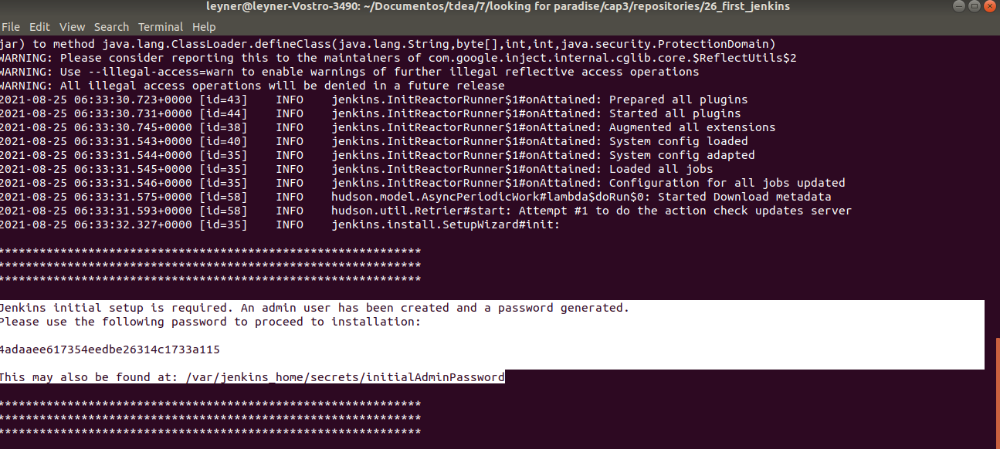
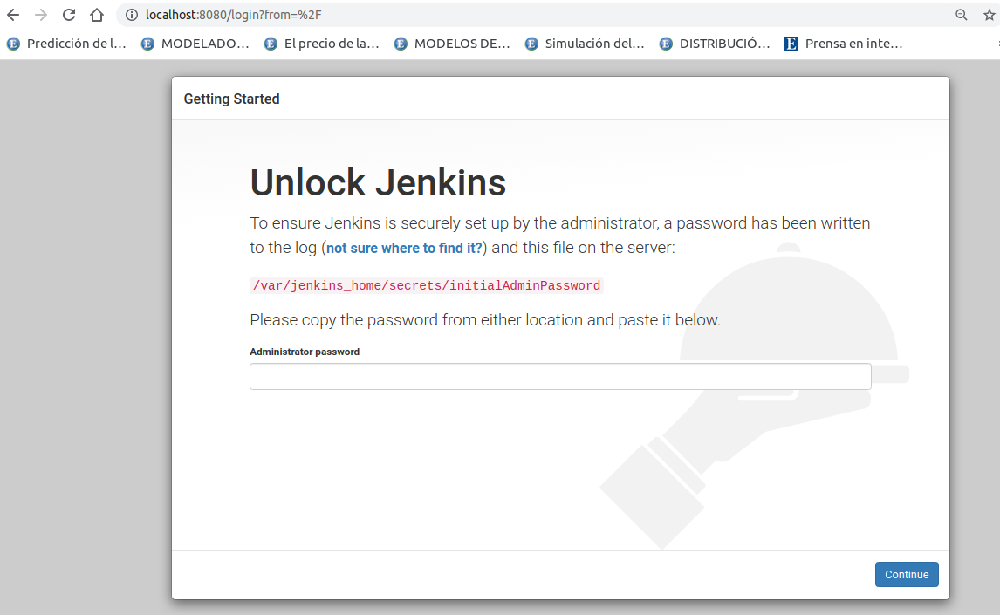
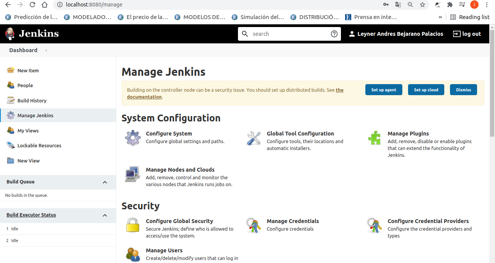
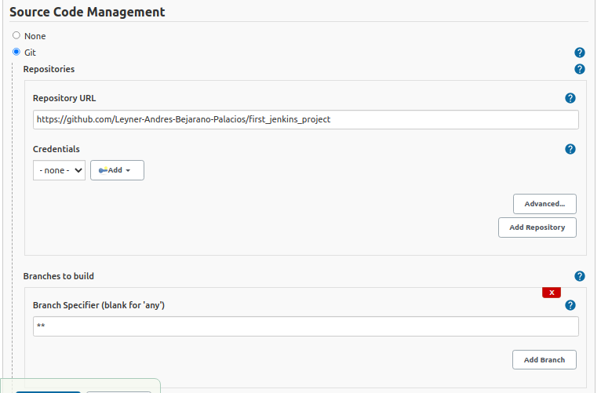
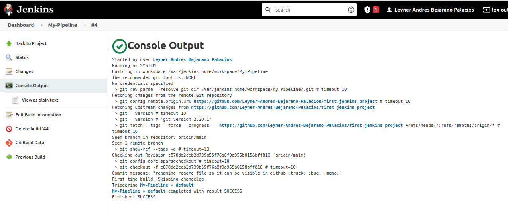
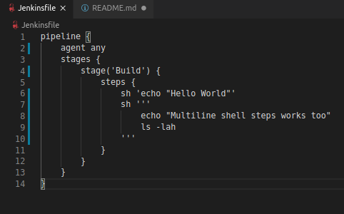

# what is jenkis

Jenkins is a self-contained, open source automation server which can be used to automate all sorts of tasks related to building, testing, and delivering or deploying software [reference](https://www.jenkins.io/doc/#:~:text=Jenkins%20is%20a%20self-contained%2C%20open%20source%20automation%20server%20which%20can%20be%20used%20to%20automate%20all%20sorts%20of%20tasks%20related%20to%20building%2C%20testing%2C%20and%20delivering%20or%20deploying%20software).

# installation for this project

As usual, for maximal portability I will be using docker, the docker image I will use is [this](https://hub.docker.com/r/jenkins/jenkins) tag jenkins/jenkins:lts-jdk11.

### step 1 

1. [source](https://github.com/jenkinsci/docker/blob/master/README.md).

### step 2 run image

1. execute the comamand below to create a 'jenkins_home' docker volume on the host machine. Docker volumes retain their content even when the container is stopped, started, or deleted.

2. docker run -p 8080:8080 -p 50000:50000 -v jenkins_home:/var/jenkins_home jenkins/jenkins:lts-jdk11

3. what we see here is part of the log generated from the commadn above, the highlithed look important, so I taking screenshot to remember this for later

### step 3 let's see the user inteface follow the instructions to complete the installation.

1. execute http://localhost:8080/ and you should see this

2. this is my first time so let's install the suggested plugins

3. I work in a multicultural enviroment so is important to keep everything in english, in this case, jenkins language will be google chrome language, to change the google chrome language follow this guide [guide](https://support.google.com/chrome/answer/173424).

### step 4 now a litte more meta, we will use this git repository for our first pipeline.

1. following this guide , let's add the java jenskisfile here (in this repository)

2. now Multibranch Pipeline > ok > Source Code Management and just put this

3. succeful run, but I was expecting to see the result of the maven version command.

4. Let's run the next step "Running multiple steps". 

so first lets change the jenkinsfile

and run it again

# To-Do

1. My next experiments
    1.  [these](https://www.jenkins.io/doc/book/pipeline/syntax/#agent).

2.  jenkinsfile using docker
    1.  [docs](https://www.jenkins.io/doc/book/pipeline/docker/).

3.  using libraries to DRY (Dont repeat yourself)
    1.  [docs](https://www.jenkins.io/doc/book/pipeline/shared-libraries/).

4.  automating best practices
    1. The best practices in jenkins [docs](https://www.jenkins.io/doc/book/pipeline/pipeline-best-practices/).

5.  multibranch for multirepos (when I need several jenkinsfile depending of the branch)
    1.  [docs](https://www.jenkins.io/doc/book/pipeline/multibranch/).  

6. adding fingerprint to record a file (using shad-256 instead of MD5 checksum because MD% can be changed witout changing the MD5)

    1. [example](https://www.youtube.com/watch?v=HvbbsoljLyg&t=300s).
    2. proof that you should not use MD5 checksum [here](https://stackoverflow.com/questions/34446317/is-it-possible-to-keep-same-md5-checksum-of-a-file-after-content-modification).
7. learning Apache Jmeter to practice this
    1. jenkins docs Apache [Jmeter](https://www.jenkins.io/doc/book/using/using-jmeter-with-jenkins/).

8. Why dont we use a distributed file system? (I mean sure it is not intended for small files but in this time it could probably works)
    1.  [context](https://www.jenkins.io/doc/book/pipeline/scaling-pipeline/).

9.  Open source contribution opportunity !!!!!!
    1.  This [one](https://www.jenkins.io/doc/book/system-administration/backing-up/).

just this for now ........

