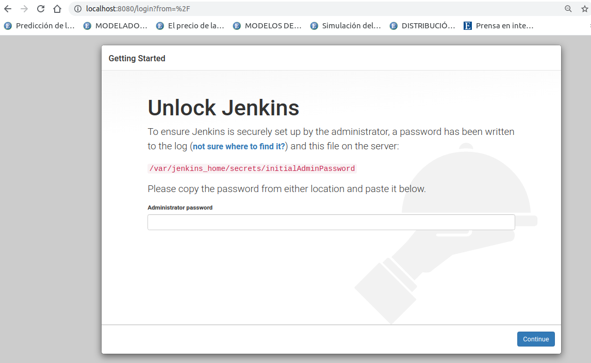
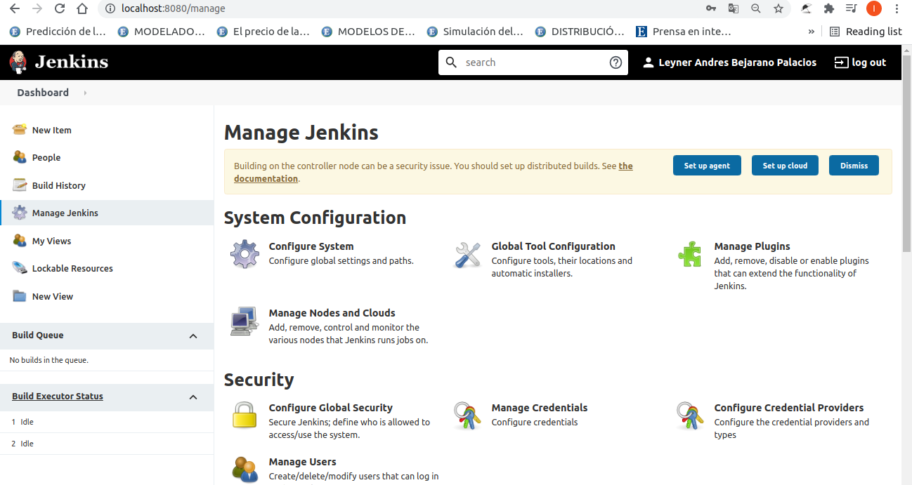

# what is jenkis

Jenkins is a self-contained, open source automation server which can be used to automate all sorts of tasks related to building, testing, and delivering or deploying software [reference](https://www.jenkins.io/doc/#:~:text=Jenkins%20is%20a%20self-contained%2C%20open%20source%20automation%20server%20which%20can%20be%20used%20to%20automate%20all%20sorts%20of%20tasks%20related%20to%20building%2C%20testing%2C%20and%20delivering%20or%20deploying%20software).

# installation for this project

As usual, for maximal portability I will be using docker, the docker image I will use is [this](https://hub.docker.com/r/jenkins/jenkins) tag jenkins/jenkins:lts-jdk11.

### step 1 

1. [source](https://github.com/jenkinsci/docker/blob/master/README.md).
2. 

### step 2 run image

1. execute the comamand below to create a 'jenkins_home' docker volume on the host machine. Docker volumes retain their content even when the container is stopped, started, or deleted.

2. docker run -p 8080:8080 -p 50000:50000 -v jenkins_home:/var/jenkins_home jenkins/jenkins:lts-jdk11

3. what we see here is part of the log generated from the commadn above, the highlithed look important, so I taking screenshot to remember this for later

### step 3 let's see the user inteface follow the instructions to complete the installation.

1. execute http://localhost:8080/ and you should see this

2. this is my first time so let's install the suggested plugins

3. I work in a multicultural enviroment so is important to keep everything in english, in this case, jenkins take language rom the google chrome language, to change the google chrome language follow this guide [guide](https://support.google.com/chrome/answer/173424).

